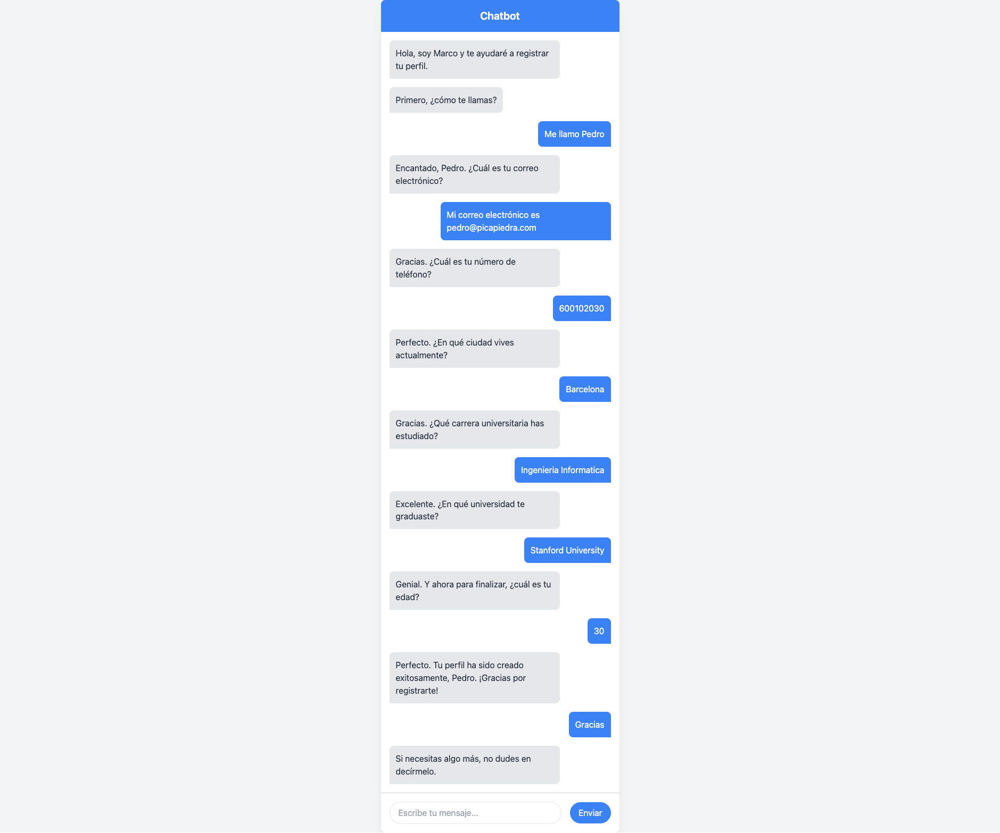

# Marco the chatbot with GPT2

**Marco** is an experimental chatbot prototype that uses [Hugging Face Transformers and openai-community/gpt2](https://huggingface.co/openai-community/gpt2) as a base model and also spaCy for the NLP (Natural Language Processing). **Marco** is based on [FastAPI](https://fastapi.tiangolo.com/) framework and [Jinja2](https://jinja.palletsprojects.com/en/3.0.x/) template engine with [Tailwind CSS](https://tailwindcss.com/) for styling.

## Running the project locally

1. Create the Python virtual environment

```sh
python3 -m venv marco-bot
```

```sh
source marco-bot/bin/activate
```

2. Install dependencies

It is recommended, first, upgrade pip:
```sh
pip install --upgrade pip
```

Install dependencies/requirements:
```sh
pip install -r requirements.txt
```

3. After to install spaCy (inside the requirements file), a free open-source library for Natural Language Processing in Python, we need to add extra models like the Spanish model

```sh
python -m spacy download es_core_news_sm
```

4. Execute the following command

```sh
uvicorn app.main:app --reload --host 0.0.0.0 --port 3000
```

and you should see an output similar to:

```
INFO:     Uvicorn running on http://127.0.0.1:3000 (Press CTRL+C to quit)
INFO:     Started reloader process [XXXXX] using WatchFiles
INFO:     Started server process [XXXX]
INFO:     Waiting for application startup.
INFO:     Application startup complete.
```

## Training and chatting with Marco

**Marco** is prepared so that, once it is started for the first time, it starts a training process from a model, defined in ```./app/models/data-training.json```. This JSON file represents a set of interactions between the bot and a user to create a profile for a social network or similar. The model, once trained, is saved locally in ```./app/models/gpt2_finetuned/```

In addition, it has different functions, such as ```extract_name```, ```extract_phone```, ```extract_email```, etc., which use *spaCy* as an NLP (Natural Language Processing) model to identify the user's name, among other things.

### Training the model

When the model is loaded successfully you will see a similar text in the terminal output:

```
Loading model and tokenizer from app/models/gpt2_finetuned.
Model and tokenizer loaded successfully.
```

### Chatting with the bot

Bellow, you have an example of a conversation with Marco:



At the end of the conversation, you will be able to see a JSON output with the captured values:

```
{
    'nombre': 'Pedro', 
    'email': 'pedro@picapiedra.com', 
    'phone': '600102030', 
    'city': 'Barcelona', 
    'career': 'Ingenieria Informatica', 
    'university': 'Stanford University', 
    'age': 30
}
```